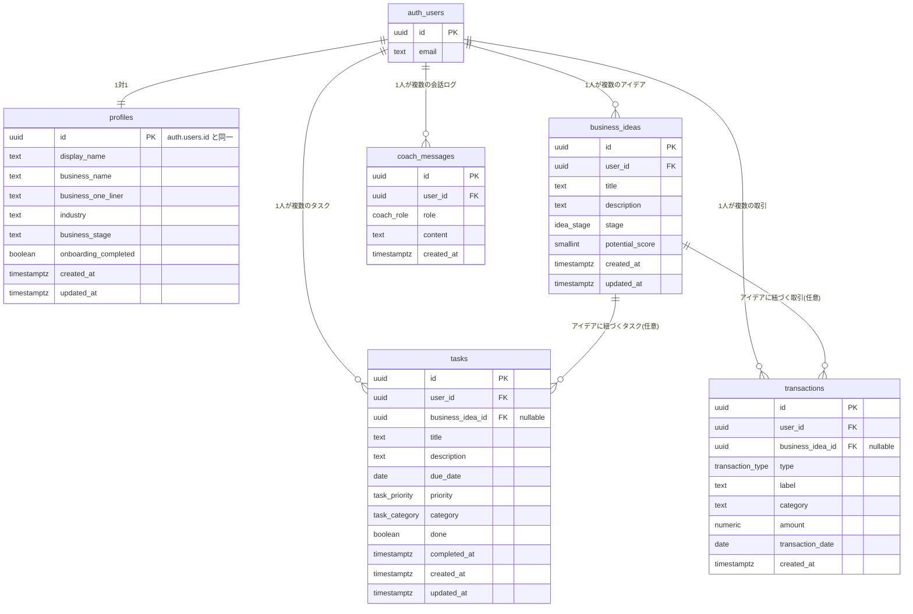

# データベース設計（Phase 2 設計ドキュメント）

このドキュメントは、Phase 1で実装したUI（Dashboard / Ideas / Tasks / Finance / Coach）が
現在使用している仮データ（`src/lib/mock-data.ts`）を、将来Supabase(PostgreSQL)の実データへ
移行するための設計をまとめたものです。

**この段階ではSupabaseへの接続・実際のテーブル作成は行っていません。** 本ドキュメントは
次のPhaseでの実装のための設計図です。

---

## 1. 現状の整理（何を確認したか）

### 1.1 現在の型定義（`src/lib/types.ts`）

| 型 | 用途 | 使用画面 |
|---|---|---|
| `BusinessIdea` | ビジネスアイデア1件 | Dashboard, Ideas |
| `IdeaStage` | アイデアの進捗段階（`draft`/`validating`/`building`/`launched`） | Dashboard, Ideas |
| `Task` | タスク1件 | Dashboard, Tasks |
| `TaskPriority` | 優先度（`HIGH`/`MEDIUM`/`LOW`） | Dashboard, Tasks |
| `TaskCategory` | タスクのカテゴリー（固定6種） | Tasks |
| `Transaction` | 売上・経費の取引1件 | Dashboard, Finance |
| `TransactionType` | `sale` \| `expense` | Dashboard, Finance |
| `CoachMessage` | AIコーチとの会話1件 | Coach |

### 1.2 現在の仮データ（`src/lib/mock-data.ts`）

- `mockIdeas: BusinessIdea[]` — 4件
- `mockTasks: Task[]` — 5件
- `mockTransactions: Transaction[]` — 6件
- `mockCoachConversation: CoachMessage[]` — 3件（会話の往復）
- `suggestedPrompts: string[]` — 静的な提案文（UI表示のみ、DB化不要）

いずれも**特定ユーザーに紐づく前提のデータ構造にはなっていない**（`user_id`のようなフィールドがない）。
Supabase移行にあたっては、全テーブルにユーザーとの紐付けを追加する必要がある。

### 1.3 各画面が実際に必要とするデータ

| 画面 | 必要なデータ | 備考 |
|---|---|---|
| Dashboard | 当月の売上/経費/利益（`calcProfit`で集計）、未完了タスク数、アイデア件数、直近タスク上位3件、アイデア上位2件 | `src/lib/finance.ts`の`calcProfit`はDB移行後も集計ロジックとして再利用可能 |
| Ideas | アイデア一覧、ステージ別フィルタ | フィルタは現状クライアント側の`useState` |
| Tasks | タスク一覧（未完了/完了）、優先度・カテゴリー・期限、完了トグル | 完了トグルは現状ローカルstateのみ（DB化で永続化が必要） |
| Finance | 売上/経費/利益/利益率、取引履歴（日付降順） | `mockTransactions`をそのまま集計・表示 |
| Coach | 会話履歴、AIが参照する事業データ（アイデア・タスク・取引） | 現状は固定の会話文。実装時はユーザーの実データをプロンプトのコンテキストとして渡す設計にする |

---

## 2. テーブル構成（ER図）

Supabaseの標準である `auth.users`（Supabase Authが管理）を起点に、
アプリ独自のテーブルをすべて `user_id` で紐付ける設計とする。



`business_idea_id` を `tasks` / `transactions` に**任意（nullable）**で持たせているのは、
「特定の事業アイデアに紐づくタスク・売上」を将来集計できるようにするため。
Phase 2のUIでは必須にせず、未選択でも登録できるようにする（既存の仮データもアイデア未指定のため）。

---

## 3. 各テーブルの詳細

### 3.1 `profiles`（ユーザーのプロフィール／事業コンテキスト）

Supabase Authの `auth.users` を拡張する1:1テーブル。AI Coachが「どんな事業か」を
把握するための最小限のコンテキストを持たせる。

| カラム | 型 | NULL | デフォルト | 説明 |
|---|---|---|---|---|
| `id` | `uuid` | NOT NULL (PK) | — | `auth.users.id` と同一値。FK制約を張る |
| `display_name` | `text` | NULL可 | — | ユーザー表示名 |
| `business_name` | `text` | NULL可 | — | 事業名（未設定=オンボーディング未完了) |
| `business_one_liner` | `text` | NULL可 | — | 事業の一言説明（AI Coachのプロンプトに使用） |
| `industry` | `text` | NULL可 | — | 業種 |
| `business_stage` | `text` | NULL可 | — | 事業全体の段階（例: アイデア検討中/開業準備中/運営中） |
| `onboarding_completed` | `boolean` | NOT NULL | `false` | 初回セットアップ完了フラグ |
| `created_at` | `timestamptz` | NOT NULL | `now()` | |
| `updated_at` | `timestamptz` | NOT NULL | `now()` | 更新トリガーで自動更新 |

- PK: `id`
- FK: `id` → `auth.users(id)` ON DELETE CASCADE

### 3.2 `business_ideas`（`BusinessIdea`に対応）

| カラム | 型 | NULL | デフォルト | 説明 |
|---|---|---|---|---|
| `id` | `uuid` | NOT NULL (PK) | `gen_random_uuid()` | |
| `user_id` | `uuid` | NOT NULL (FK) | — | `auth.users(id)` |
| `title` | `text` | NOT NULL | — | |
| `description` | `text` | NULL可 | — | |
| `stage` | `idea_stage` (enum) | NOT NULL | `'draft'` | `draft`/`validating`/`building`/`launched` |
| `potential_score` | `smallint` | NOT NULL | `0` | 0〜100。CHECK制約で範囲を保証 |
| `created_at` | `timestamptz` | NOT NULL | `now()` | |
| `updated_at` | `timestamptz` | NOT NULL | `now()` | |

- CHECK: `potential_score BETWEEN 0 AND 100`
- INDEX: `(user_id)`、`(user_id, stage)`（ステージ別フィルタ用）

### 3.3 `tasks`（`Task`に対応）

| カラム | 型 | NULL | デフォルト | 説明 |
|---|---|---|---|---|
| `id` | `uuid` | NOT NULL (PK) | `gen_random_uuid()` | |
| `user_id` | `uuid` | NOT NULL (FK) | — | |
| `business_idea_id` | `uuid` | NULL可 (FK) | — | 関連アイデア（任意） |
| `title` | `text` | NOT NULL | — | |
| `description` | `text` | NULL可 | — | |
| `due_date` | `date` | NULL可 | — | |
| `priority` | `task_priority` (enum) | NOT NULL | `'MEDIUM'` | `HIGH`/`MEDIUM`/`LOW` |
| `category` | `task_category` (enum) | NOT NULL | `'その他'` | 商品/マーケティング/営業/資金調達/運営/その他 |
| `done` | `boolean` | NOT NULL | `false` | |
| `completed_at` | `timestamptz` | NULL可 | — | `done`をtrueにした時刻 |
| `created_at` | `timestamptz` | NOT NULL | `now()` | |
| `updated_at` | `timestamptz` | NOT NULL | `now()` | |

- FK: `business_idea_id` → `business_ideas(id)` ON DELETE SET NULL
- INDEX: `(user_id)`、`(user_id, done)`（Dashboardの未完了カウント用）、`(user_id, due_date)`（今日のタスク抽出用）

### 3.4 `transactions`（`Transaction`に対応）

| カラム | 型 | NULL | デフォルト | 説明 |
|---|---|---|---|---|
| `id` | `uuid` | NOT NULL (PK) | `gen_random_uuid()` | |
| `user_id` | `uuid` | NOT NULL (FK) | — | |
| `business_idea_id` | `uuid` | NULL可 (FK) | — | 関連アイデア（任意） |
| `type` | `transaction_type` (enum) | NOT NULL | — | `sale` \| `expense` |
| `label` | `text` | NOT NULL | — | 取引の名称 |
| `category` | `text` | NOT NULL | — | 例: 商品売上/マーケティング/運営費（Phase 3で正規化を検討、3.6参照） |
| `amount` | `numeric(12,2)` | NOT NULL | — | 常に正の値。符号は`type`で判断 |
| `transaction_date` | `date` | NOT NULL | — | 現在の型では`date`という名称だが、SQL予約語との混同を避け`transaction_date`とする |
| `created_at` | `timestamptz` | NOT NULL | `now()` | |

- CHECK: `amount > 0`
- FK: `business_idea_id` → `business_ideas(id)` ON DELETE SET NULL
- INDEX: `(user_id, transaction_date)`（Financeの集計・並び替え用）、`(user_id, type)`

### 3.5 `coach_messages`（`CoachMessage`に対応、会話履歴の永続化）

| カラム | 型 | NULL | デフォルト | 説明 |
|---|---|---|---|---|
| `id` | `uuid` | NOT NULL (PK) | `gen_random_uuid()` | |
| `user_id` | `uuid` | NOT NULL (FK) | — | |
| `role` | `coach_role` (enum) | NOT NULL | — | `coach` \| `user` |
| `content` | `text` | NOT NULL | — | |
| `created_at` | `timestamptz` | NOT NULL | `now()` | 会話の並び順に使用 |

- INDEX: `(user_id, created_at)`（時系列表示用）

### 3.6 将来的な拡張候補（Phase 2では作成しない）

| テーブル | 目的 |
|---|---|
| `categories` | `transactions.category` を自由入力からマスタ管理に切り替える場合 |
| `customers` | 顧客管理機能を追加する場合 |
| `businesses` | 1ユーザーが複数事業を並行管理する場合（現在のUI/仮データは1人1事業前提のため今回は見送り） |

---

## 4. Row Level Security（RLS）の考え方

Supabaseは PostgreSQL の RLS をそのまま使う。**すべてのテーブルでRLSを有効化し、
「自分の`user_id`の行しか読み書きできない」を徹底する。**

### 4.1 基本方針

1. 全テーブルで `ALTER TABLE ... ENABLE ROW LEVEL SECURITY;` を実行する
2. ポリシーは原則「`user_id = auth.uid()`」の1パターンに統一する（SELECT/INSERT/UPDATE/DELETEの4種）
3. `profiles` のみ `id = auth.uid()` で判定（`id`自体がユーザーID）
4. INSERT時は `user_id` をクライアントから送らせず、`default auth.uid()` にするか、
   アプリ側で必ずログインユーザーのIDをセットする運用にする

### 4.2 ポリシー例（`business_ideas`の場合、他テーブルも同様のパターン）

```sql
alter table business_ideas enable row level security;

create policy "select own ideas"
  on business_ideas for select
  using (auth.uid() = user_id);

create policy "insert own ideas"
  on business_ideas for insert
  with check (auth.uid() = user_id);

create policy "update own ideas"
  on business_ideas for update
  using (auth.uid() = user_id)
  with check (auth.uid() = user_id);

create policy "delete own ideas"
  on business_ideas for delete
  using (auth.uid() = user_id);
```

同じ4ポリシーのセットを `tasks` / `transactions` / `coach_messages` にも適用する。
`profiles` は `user_id` ではなく `id` を条件にする点のみ異なる。

### 4.3 新規ユーザー登録時のprofiles自動作成

`auth.users` にレコードが作成された直後に `profiles` を自動生成するため、
Supabase標準パターンの `handle_new_user` トリガー関数を使う（Phase 2後半、認証実装時に作成）。

---

## 5. AI Coachがユーザーの事業データを参照できる構造

「Business Ideas / Tasks / Finance のデータをもとにAIが助言する」ためには、
AI呼び出し時に**そのユーザーのデータだけを集めてコンテキストとして渡す**設計にする。

### 5.1 データ取得の考え方

- AI Coach機能（サーバー側処理、例: Next.jsのRoute Handler）が呼ばれた際、
  **常にログインユーザーの`auth.uid()`を起点に**以下を取得する:
  - `profiles`（事業の一言説明・業種・段階）
  - `business_ideas`（進行中のアイデア、特に`validating`/`building`を優先）
  - `tasks`（未完了かつ期限が近いもの）
  - `transactions`の直近集計（`calcProfit`と同じロジックで売上/経費/利益を算出）
- これらをテキスト化してAIへのプロンプトのコンテキストとして渡す（RAG的な扱い）
- RLSが効いているため、Supabase側のクエリ自体が「そのユーザーの行しか返さない」ことが保証される
  → **アプリ側のバグでも他ユーザーのデータが混入しない**のが利点

### 5.2 会話ログの扱い

- `coach_messages` に `role`（`coach`/`user`）と`content`を時系列で保存
- 直近N件（例: 20件）を会話履歴としてAIに渡す想定
- Phase 2ではテーブル設計のみ行い、実際のAI API接続はPhase 3で実装する

---

## 6. TypeScript型との対応関係

Supabase移行後は、Supabaseの型生成（`supabase gen types typescript`）で自動生成される型と、
現在の`src/lib/types.ts`のアプリ内部向け型を分離する想定。

| 現在の型 (`types.ts`) | 対応テーブル | 移行時の変更点 |
|---|---|---|
| `BusinessIdea` | `business_ideas` | `id`が`string`のまま(uuid文字列)で互換、フィールド名はそのまま利用可能 |
| `Task` | `tasks` | 同上。`business_idea_id`はUI未対応のため後で追加 |
| `Transaction` | `transactions` | `date`→DBは`transaction_date`。UI側の型は`date`のまま、取得時にマッピングする関数を用意する |
| `CoachMessage` | `coach_messages` | ほぼそのまま対応 |

`src/lib/finance.ts`の`calcProfit`・`formatYen`は**DBを意識しないロジック**なので、
Supabaseから取得した`Transaction[]`をそのまま渡せば移行後もそのまま使える。

---

## 7. Supabaseを導入するための次の手順（Phase 2の実装ステップ案）

まだ何も実行していません。合意が取れ次第、以下の順で進める想定です。

1. Supabaseプロジェクトを作成し、URL・Anon Keyを取得（ユーザー側の作業）
2. `.env.local` に `NEXT_PUBLIC_SUPABASE_URL` / `NEXT_PUBLIC_SUPABASE_ANON_KEY` を設定（`.env.example`に定義済み、値はコミットしない）
3. `@supabase/supabase-js` と `@supabase/ssr` を導入
4. `src/lib/supabase/client.ts`（ブラウザ用）・`server.ts`（サーバー用）を作成
5. 本ドキュメントに基づき、`supabase/migrations/` にSQL（enum定義 → テーブル作成 → インデックス → RLSポリシー）を作成
6. Supabase CLIまたはダッシュボードでマイグレーションを適用し、テーブルが設計通りか確認
7. 認証を実装（まずは本人1人のメール+パスワード、またはマジックリンク）し、`handle_new_user`トリガーで`profiles`を自動作成
8. 画面を1つずつ仮データからSupabaseクエリへ移行する（推奨順: Tasks → Finance → Ideas → Dashboard → Coach）。
   1画面移行するごとに`npm run build` / `npm run lint`と実機確認を行う
9. RLSが正しく機能しているか、別アカウントを作って他人のデータが見えないことを確認する
10. Coach機能はテーブルとデータ取得ロジックの準備が整った後、Phase 3でAI API接続に着手する

この設計に問題がなければ、次はステップ3〜4（Supabaseクライアントのセットアップ）から着手します。
