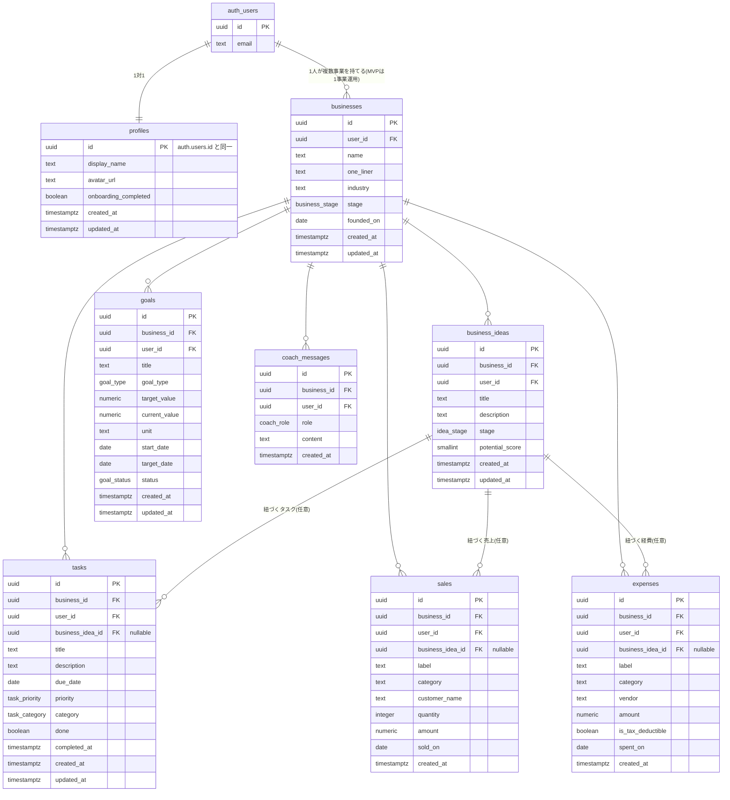

# データベース設計（本番用データ設計）

対象アプリ: **起業しよ。**
起業したい人・学生起業家・副業を始めたい人・個人事業主・小規模事業者が、
アイデアを実際のビジネスに変えていくためのAIビジネス支援アプリ。

このドキュメントは、現在`src/lib/mock-data.ts`で使用している仮データを、
将来Supabase(PostgreSQL)の実データへ移行するための**本番用データ設計**をまとめたものです。

**この段階ではSupabaseへの接続・APIキー設定・認証実装・AI API実装・UIの変更は一切行っていません。**
コード変更なし、本ドキュメントの作成のみを行いました。

> 前版からの主な変更点: アプリ名を「起業しよ。」に正式決定。「ビジネス(`businesses`)」
> 「目標(`goals`)」を新しい独立エンティティとして追加。「取引(`transactions`)」を
> 「売上(`sales`)」「経費(`expenses`)」の2テーブルに分離。すべての子テーブルが
> `businesses`を介してユーザーに紐づく階層構造に変更（詳細は1章）。

---

## 1. データベース全体の構造

### 1.1 階層設計の方針

要件通り、**ユーザーごとにデータが完全に分離される**ことを前提に、以下の階層で設計する。

```
User A
 └ Business (User Aの事業)
    ├ Business Ideas
    ├ Tasks
    ├ Goals
    ├ Sales
    ├ Expenses
    └ Coach Messages

User B
 └ Business (User Bの事業)
    ├ Business Ideas
    ├ Tasks
    ├ Goals
    ├ Sales
    ├ Expenses
    └ Coach Messages
```

- すべての事業データ（アイデア/タスク/目標/売上/経費/AI会話）は`businesses`を親として持つ
- 加えて、**RLSを単純かつ高速にするため`user_id`を全テーブルに冗長に持たせる**（詳細は6章）
- MVPでは「1ユーザー1事業」の運用を想定するが、スキーマ上は1ユーザーが複数の`businesses`を持てる設計にしておく（将来、複業・複数事業展開に対応できるようにするため）

### 1.2 ER図



---

## 2. 各テーブルの詳細

共通ルール:
- 主キーは`uuid` (`default gen_random_uuid()`)
- 日時は`timestamptz`、`created_at`は`default now()`、更新系テーブルは`updated_at`を持ちトリガーで自動更新
- 金額は`numeric(12,2)`
- 列挙値は原則PostgreSQLの`enum`型で定義（アプリ側の`type Literal`とそのまま対応させる）

### 2.1 `profiles`（個人プロフィール）

事業に関する情報は`businesses`に切り出したため、`profiles`は**個人の情報のみ**を持つ。

| カラム | 型 | 必須 | デフォルト | 主キー/外部キー |
|---|---|---|---|---|
| `id` | `uuid` | 必須 | — | PK。`auth.users(id)`のFK（ON DELETE CASCADE） |
| `display_name` | `text` | 任意 | — | |
| `avatar_url` | `text` | 任意 | — | |
| `onboarding_completed` | `boolean` | 必須 | `false` | |
| `created_at` | `timestamptz` | 必須 | `now()` | |
| `updated_at` | `timestamptz` | 必須 | `now()` | |

- インデックス: 不要（PKのみで十分。1行 = 1ユーザー）
- RLS: `id = auth.uid()`

### 2.2 `businesses`（ビジネス）

ユーザーが運営する事業そのもの。以降の全テーブルの親となる。

| カラム | 型 | 必須 | デフォルト | 主キー/外部キー |
|---|---|---|---|---|
| `id` | `uuid` | 必須 | `gen_random_uuid()` | PK |
| `user_id` | `uuid` | 必須 | — | FK → `auth.users(id)` ON DELETE CASCADE |
| `name` | `text` | 必須 | — | 事業名（未入力=オンボーディング未完了の扱い） |
| `one_liner` | `text` | 任意 | — | 事業の一言説明。AI Coachのプロンプトで使用 |
| `industry` | `text` | 任意 | — | 業種 |
| `stage` | `business_stage` (enum) | 必須 | `'idea'` | `idea`/`preparing`/`operating`/`paused` |
| `founded_on` | `date` | 任意 | — | 創業日・開始日 |
| `created_at` | `timestamptz` | 必須 | `now()` | |
| `updated_at` | `timestamptz` | 必須 | `now()` | |

- インデックス: `(user_id)`
- RLS: `user_id = auth.uid()`
- 備考: MVPでは1ユーザー1行の運用を想定。強制する場合はアプリ側で「2つ目の作成を防ぐ」UIにするか、`unique(user_id)`部分インデックスを追加する（将来複数事業に対応する場合は外す）

### 2.3 `business_ideas`（ビジネスアイデア）

| カラム | 型 | 必須 | デフォルト | 主キー/外部キー |
|---|---|---|---|---|
| `id` | `uuid` | 必須 | `gen_random_uuid()` | PK |
| `business_id` | `uuid` | 必須 | — | FK → `businesses(id)` ON DELETE CASCADE |
| `user_id` | `uuid` | 必須 | — | FK → `auth.users(id)`（RLS高速化のための冗長列。6章参照） |
| `title` | `text` | 必須 | — | |
| `description` | `text` | 任意 | — | |
| `stage` | `idea_stage` (enum) | 必須 | `'draft'` | `draft`/`validating`/`building`/`launched` |
| `potential_score` | `smallint` | 必須 | `0` | 0〜100。CHECK制約 |
| `created_at` | `timestamptz` | 必須 | `now()` | |
| `updated_at` | `timestamptz` | 必須 | `now()` | |

- インデックス: `(business_id)`、`(business_id, stage)`（ステージ別フィルタ用）
- RLS: `user_id = auth.uid()`

### 2.4 `tasks`（タスク）

| カラム | 型 | 必須 | デフォルト | 主キー/外部キー |
|---|---|---|---|---|
| `id` | `uuid` | 必須 | `gen_random_uuid()` | PK |
| `business_id` | `uuid` | 必須 | — | FK → `businesses(id)` ON DELETE CASCADE |
| `user_id` | `uuid` | 必須 | — | FK → `auth.users(id)` |
| `business_idea_id` | `uuid` | 任意 | — | FK → `business_ideas(id)` ON DELETE SET NULL |
| `title` | `text` | 必須 | — | |
| `description` | `text` | 任意 | — | |
| `due_date` | `date` | 任意 | — | |
| `priority` | `task_priority` (enum) | 必須 | `'MEDIUM'` | `HIGH`/`MEDIUM`/`LOW` |
| `category` | `task_category` (enum) | 必須 | `'その他'` | 商品/マーケティング/営業/資金調達/運営/その他 |
| `done` | `boolean` | 必須 | `false` | |
| `completed_at` | `timestamptz` | 任意 | — | |
| `created_at` | `timestamptz` | 必須 | `now()` | |
| `updated_at` | `timestamptz` | 必須 | `now()` | |

- インデックス: `(business_id)`、`(business_id, done)`（未完了カウント用）、`(business_id, due_date)`（今日のタスク抽出用）
- RLS: `user_id = auth.uid()`

### 2.5 `goals`（目標）

| カラム | 型 | 必須 | デフォルト | 主キー/外部キー |
|---|---|---|---|---|
| `id` | `uuid` | 必須 | `gen_random_uuid()` | PK |
| `business_id` | `uuid` | 必須 | — | FK → `businesses(id)` ON DELETE CASCADE |
| `user_id` | `uuid` | 必須 | — | FK → `auth.users(id)` |
| `title` | `text` | 必須 | — | 例:「月商10万円を達成する」 |
| `description` | `text` | 任意 | — | |
| `goal_type` | `goal_type` (enum) | 必須 | — | `revenue`/`profit`/`sales_count`/`custom`（4章で計算方法を説明） |
| `target_value` | `numeric(12,2)` | 必須 | — | 目標値 |
| `current_value` | `numeric(12,2)` | 必須 | `0` | `custom`型は手動更新。`revenue`/`profit`/`sales_count`型は表示時にDBから都度計算するため参考値として保持（4.3参照） |
| `unit` | `text` | 任意 | — | 例:「円」「件」 |
| `start_date` | `date` | 必須 | `current_date` | 進捗集計の起点 |
| `target_date` | `date` | 任意 | — | 期限 |
| `status` | `goal_status` (enum) | 必須 | `'active'` | `active`/`achieved`/`missed`/`paused` |
| `created_at` | `timestamptz` | 必須 | `now()` | |
| `updated_at` | `timestamptz` | 必須 | `now()` | |

- インデックス: `(business_id)`、`(business_id, status)`（Dashboardの進捗表示用）
- RLS: `user_id = auth.uid()`
- CHECK: `target_value > 0`

### 2.6 `sales`（売上）

| カラム | 型 | 必須 | デフォルト | 主キー/外部キー |
|---|---|---|---|---|
| `id` | `uuid` | 必須 | `gen_random_uuid()` | PK |
| `business_id` | `uuid` | 必須 | — | FK → `businesses(id)` ON DELETE CASCADE |
| `user_id` | `uuid` | 必須 | — | FK → `auth.users(id)` |
| `business_idea_id` | `uuid` | 任意 | — | FK → `business_ideas(id)` ON DELETE SET NULL |
| `label` | `text` | 必須 | — | 取引名（例:「オンライン講座 販売」） |
| `category` | `text` | 必須 | — | 例: 商品売上/サービス売上（Phase 3でマスタ化を検討） |
| `customer_name` | `text` | 任意 | — | |
| `quantity` | `integer` | 任意 | `1` | |
| `amount` | `numeric(12,2)` | 必須 | — | CHECK: `amount > 0` |
| `sold_on` | `date` | 必須 | — | |
| `created_at` | `timestamptz` | 必須 | `now()` | |

- インデックス: `(business_id, sold_on)`（Financeの集計・並び替え用）
- RLS: `user_id = auth.uid()`

### 2.7 `expenses`（経費）

| カラム | 型 | 必須 | デフォルト | 主キー/外部キー |
|---|---|---|---|---|
| `id` | `uuid` | 必須 | `gen_random_uuid()` | PK |
| `business_id` | `uuid` | 必須 | — | FK → `businesses(id)` ON DELETE CASCADE |
| `user_id` | `uuid` | 必須 | — | FK → `auth.users(id)` |
| `business_idea_id` | `uuid` | 任意 | — | FK → `business_ideas(id)` ON DELETE SET NULL |
| `label` | `text` | 必須 | — | 例:「広告費(SNS運用)」 |
| `category` | `text` | 必須 | — | 例: マーケティング/運営費/外注費 |
| `vendor` | `text` | 任意 | — | 支払先 |
| `amount` | `numeric(12,2)` | 必須 | — | CHECK: `amount > 0` |
| `is_tax_deductible` | `boolean` | 必須 | `true` | 確定申告を見据えた将来拡張用フラグ |
| `spent_on` | `date` | 必須 | — | |
| `created_at` | `timestamptz` | 必須 | `now()` | |

- インデックス: `(business_id, spent_on)`
- RLS: `user_id = auth.uid()`

`sales`と`expenses`を分けた理由: 現在の仮データ（`Transaction`型 + `type`列で判別）は将来的に片方だけに必要な項目（売上側の顧客名・数量、経費側の支払先・税務フラグ)が増えると1テーブルでは不自然になるため、実務の会計ソフトに近い形で最初から分離した。両テーブルとも同じ`(business_id, 日付)`のインデックス設計・同じ集計方法（4章）を使うため、扱い方はほぼ共通。

### 2.8 `coach_messages`（AI Coach 会話履歴）

| カラム | 型 | 必須 | デフォルト | 主キー/外部キー |
|---|---|---|---|---|
| `id` | `uuid` | 必須 | `gen_random_uuid()` | PK |
| `business_id` | `uuid` | 必須 | — | FK → `businesses(id)` ON DELETE CASCADE |
| `user_id` | `uuid` | 必須 | — | FK → `auth.users(id)` |
| `role` | `coach_role` (enum) | 必須 | — | `user`/`coach` |
| `content` | `text` | 必須 | — | |
| `created_at` | `timestamptz` | 必須 | `now()` | 会話の並び順に使用 |

- インデックス: `(business_id, created_at)`（時系列表示・直近N件取得用）
- RLS: `user_id = auth.uid()`
- 備考: MVPは1事業=1つの連続した会話ログというシンプルな構造。「会話をトピックごとに分ける（スレッド化）」は7章の拡張候補とし、今回は設計しない

---

## 3. テーブル間のリレーション

| 親 | 子 | 種類 | 削除時の挙動 |
|---|---|---|---|
| `auth.users` | `profiles` | 1:1 | CASCADE（退会時にプロフィールも削除） |
| `auth.users` | `businesses` | 1:N（MVP運用は1:1相当） | CASCADE |
| `businesses` | `business_ideas` | 1:N | CASCADE |
| `businesses` | `tasks` | 1:N | CASCADE |
| `businesses` | `goals` | 1:N | CASCADE |
| `businesses` | `sales` | 1:N | CASCADE |
| `businesses` | `expenses` | 1:N | CASCADE |
| `businesses` | `coach_messages` | 1:N | CASCADE |
| `business_ideas` | `tasks` | 1:N（任意） | SET NULL |
| `business_ideas` | `sales` | 1:N（任意） | SET NULL |
| `business_ideas` | `expenses` | 1:N（任意） | SET NULL |

`business_idea_id`を`tasks`/`sales`/`expenses`に**任意**で持たせているのは、
「特定のアイデアに紐づくタスク・売上・経費」を将来アイデア単位で集計できるようにするため。
Phase 2時点のUIでは未選択でも登録できる想定（現在の仮データもアイデア未指定）。

---

## 4. Dashboardのデータ計算方法

Dashboardは常に「ログインユーザーの`business_id`」を起点に、以下をDBから計算する
（アプリ側の`src/lib/finance.ts`の`calcProfit`と同じ考え方をSQL/クエリに置き換える）。

### 4.1 売上・経費・利益・利益率（当月）

```sql
-- 売上
select coalesce(sum(amount), 0) as sales
from sales
where business_id = :business_id
  and sold_on >= date_trunc('month', current_date)
  and sold_on < date_trunc('month', current_date) + interval '1 month';

-- 経費
select coalesce(sum(amount), 0) as expenses
from expenses
where business_id = :business_id
  and spent_on >= date_trunc('month', current_date)
  and spent_on < date_trunc('month', current_date) + interval '1 month';
```

- 利益 = 売上 − 経費
- 利益率 = 売上が0のとき0、それ以外は `round(利益 / 売上 * 100)`
- アプリ側の`calcProfit`関数はDBから取得した`sales[]`/`expenses[]`の配列をそのまま渡せば移行後も再利用できる（合算元のテーブルが1つから2つに分かれる点のみ、取得クエリ側で吸収する）

### 4.2 未完了タスク・アイデア数

```sql
select count(*) from tasks where business_id = :business_id and done = false;
select count(*) from business_ideas where business_id = :business_id;
```

### 4.3 目標進捗

`goal_type`によって「現在値」の算出方法を分ける。

| `goal_type` | 現在値の算出方法 |
|---|---|
| `revenue` | `sales`から`start_date`〜`target_date`(または今日)の`amount`を合算 |
| `profit` | 同期間の`sales`合計 − `expenses`合計 |
| `sales_count` | 同期間の`sales`の件数（`count(*)`） |
| `custom` | `goals.current_value`をそのまま使用（ユーザーまたは将来の他機能が手動更新） |

```sql
-- 例: revenue型の目標の進捗
select coalesce(sum(amount), 0) as current_value
from sales
where business_id = :business_id
  and sold_on >= goal.start_date
  and sold_on <= coalesce(goal.target_date, current_date);
```

進捗率 = `min(100, round(current_value / target_value * 100))`

Dashboardには「直近の`target_date`を持つ`active`状態のgoal」を代表目標として1件表示する想定
（`order by target_date asc nulls last limit 1`）。

### 4.4 まとめて取得する場合

Dashboardは複数の集計を1回の画面表示で必要とするため、Supabase実装時は
Postgresの`view`（例: `dashboard_summary`）またはRPC関数（`get_dashboard_summary(business_id)`）
としてサーバー側にまとめておくと、クライアントからの往復回数を減らせる。これは実装フェーズの
最適化事項であり、今回のテーブル設計には影響しない。

---

## 5. AI Coachが利用するデータ

AI Coachが「今何をすべきか」を提案するために参照するデータと、その取得範囲は以下の通り。

### 5.1 参照するテーブルと目的

| データ | 参照テーブル | 用途 |
|---|---|---|
| 事業内容 | `businesses` | 業種・事業段階・一言説明をプロンプトの前提情報にする |
| ビジネスアイデア | `business_ideas` | 進行中（`validating`/`building`）のアイデアを優先的に文脈に含める |
| タスク | `tasks` | 未完了かつ期限が近いものを優先。停滞しているタスク（`due_date`超過）も検出材料にする |
| 目標 | `goals` | `active`な目標とその進捗率（4.3の計算結果）を渡し、達成に向けた提案の軸にする |
| 売上/経費 | `sales` / `expenses` | 直近の収支トレンド（今月・先月比較など）を提案の根拠にする |
| 事業の進捗 | 上記すべての組み合わせ | 「アイデア数は多いが未着手」「売上はあるが利益率が低い」等の状況判断に使う |
| 会話履歴 | `coach_messages` | 直近N件（例: 20件）を会話の文脈として渡す |

### 5.2 データ取得の設計方針

- AI Coach機能（サーバー側、例: Next.jsのRoute Handler）は、**常にログインユーザーの`auth.uid()`から`business_id`を解決**した上で、上記テーブルを`business_id`で絞り込んで取得する
- RLSが有効なため、Supabase側のクエリ自体が「そのユーザーの事業データしか返さない」ことを保証する。**アプリ側のロジックにミスがあっても他ユーザーのデータが混入しない**のが最大の利点
- 取得したデータはテキスト化してAIへのプロンプトのコンテキストとして渡す（RAG的な扱い）。想定するコンテキストの一例:

```
[事業] 名前: ○○○○ / 業種: ○○ / 段階: 検証中
[目標] 月商10万円を達成する（進捗: 61%、残り19日）
[直近の収支] 今月の売上 ¥95,500 / 経費 ¥33,800 / 利益率 65%
[進行中のアイデア] サブスク型パーソナル栄養コーチ（検証中、ポテンシャル78）
[今日のタスク] 競合3社の価格リサーチ（HIGH、期限本日）, LP用のキャッチコピー案（HIGH、期限本日）
[直近の会話] ...(coach_messagesの末尾N件)
```

- AI API接続自体は今回のPhaseでは実装しない。ここではデータ設計のみ確定する

---

## 6. RLSの設計方針

### 6.1 基本方針

1. すべてのテーブルで`ALTER TABLE ... ENABLE ROW LEVEL SECURITY;`を実行する
2. `profiles`は`id = auth.uid()`、それ以外の全テーブルは**`user_id = auth.uid()`**の1パターンに統一する
3. `business_id`ではなく`user_id`をRLS条件にするのは、`businesses`テーブルへのサブクエリ結合をRLSポリシー内で毎回行うより、各行に`user_id`を直接持たせて単純比較する方が高速かつポリシーが読みやすいため（インデックス`(user_id)`が効く）
4. その代わり、`business_id`と`user_id`の整合性（「そのbusinessが本当にそのuserのものか」）をアプリ層任せにしないよう、**トリガーで検証する**（6.3）

### 6.2 ポリシー例（`tasks`の場合、他テーブルも同一パターン）

```sql
alter table tasks enable row level security;

create policy "select own tasks"
  on tasks for select
  using (auth.uid() = user_id);

create policy "insert own tasks"
  on tasks for insert
  with check (auth.uid() = user_id);

create policy "update own tasks"
  on tasks for update
  using (auth.uid() = user_id)
  with check (auth.uid() = user_id);

create policy "delete own tasks"
  on tasks for delete
  using (auth.uid() = user_id);
```

同じ4ポリシーのセットを`businesses` / `business_ideas` / `goals` / `sales` / `expenses` / `coach_messages`にも適用する。

### 6.3 `business_id`と`user_id`の整合性保証（トリガー）

`user_id`を冗長に持たせる設計では、「他人の`business_id`を指定しつつ自分の`user_id`を入れる」不正なINSERTを
RLSだけでは防げない。そこで、INSERT/UPDATE時に「指定された`business_id`の所有者が`user_id`と一致するか」を
検証するトリガー関数を各子テーブルに設定する。

```sql
create or replace function check_business_owner()
returns trigger as $$
begin
  if not exists (
    select 1 from businesses
    where id = new.business_id and user_id = new.user_id
  ) then
    raise exception 'business_id does not belong to user_id';
  end if;
  return new;
end;
$$ language plpgsql security definer;

create trigger trg_check_business_owner
  before insert or update on tasks
  for each row execute function check_business_owner();
```

同じトリガーを`business_ideas` / `goals` / `sales` / `expenses` / `coach_messages`にも設定する。

### 6.4 新規ユーザー登録時の自動処理

`auth.users`にレコードが作成された直後、Supabase標準の`handle_new_user`トリガーパターンで
`profiles`を自動生成する（認証実装フェーズで作成）。`businesses`の自動作成は行わず、
オンボーディング画面でユーザー自身に事業名を入力してもらい作成する想定。

---

## 7. 将来的な拡張性

今回は設計しない（テーブルを作成しない）が、スキーマ上ぶつからないように余地を残している項目。

| 拡張候補 | 内容 |
|---|---|
| `coach_conversations` | `coach_messages`をスレッド化する場合に追加。`coach_messages`に`conversation_id`を足すだけで対応可能 |
| `categories` | `sales.category` / `expenses.category`を自由入力からマスタ管理に切り替える場合 |
| `customers` | 顧客管理機能を追加する場合。`sales.customer_name`を`customer_id`に置き換える形で移行可能 |
| 複数事業対応の本格化 | `businesses`は既に1:N設計のため、UI側で事業切り替えを実装するだけで対応できる |
| チームメンバー招待 | `business_members`（`business_id` + `user_id` + `role`）のような中間テーブルを追加すれば、個人利用から複数人運用へ拡張できる |

---

## 8. Supabase実装時の注意点

1. **enum型の作成順序**: `business_stage` / `idea_stage` / `task_priority` / `task_category` / `goal_type` / `goal_status` / `coach_role`を先にCREATE TYPEし、その後テーブルを作成する
2. **`gen_random_uuid()`**: Supabaseは`pgcrypto`拡張が既定で有効なため追加設定は不要。念のため`create extension if not exists pgcrypto;`をマイグレーション先頭に入れる
3. **`updated_at`の自動更新**: 全テーブル共通の`set_updated_at()`トリガー関数を1つ作り、各テーブルの`BEFORE UPDATE`に適用する
4. **フロントエンドの型との差分**: 現在の`src/lib/types.ts`は本設計より前の仮モデル（`Transaction`が売上/経費統合、`Business`/`Goal`型が存在しない）。Supabase接続時に合わせて型を更新する必要があるが、**今回のPhaseでは変更しない**
   - `Transaction` → `Sale` / `Expense` に分割
   - 新規に`Business`型・`Goal`型を追加
   - `BusinessIdea` / `Task` / `CoachMessage`は`business_id`と`user_id`が増える以外はほぼ現行のまま流用可能
5. **移行順序**: テーブル作成 → RLS/トリガー設定 → 認証実装（`handle_new_user`） → 画面ごとにモックからSupabaseクエリへ置き換え（推奨順: Tasks → Sales/Expenses(Finance) → Ideas → Goals → Dashboard → Coach）
6. **RLSのテスト**: 実装後、2つ以上のテストアカウントを作成し、互いのデータが見えない・操作できないことを確認する
7. **APIキー**: Supabase URL・Anon Keyは`.env.local`に設定し、`.env.example`（既存）にはプレースホルダーのみを残す。コードやコミットに直接値を書かない

---

## 次のPhaseの候補

この設計に合意が得られたら、次は以下のいずれかから着手する想定です（今回は未着手）。

- Supabaseプロジェクトの作成とマイグレーションSQLの作成（本設計をそのままSQL化）
- 認証（Supabase Auth）の実装
- フロントエンドの型定義（`types.ts`）を本設計に合わせて更新
